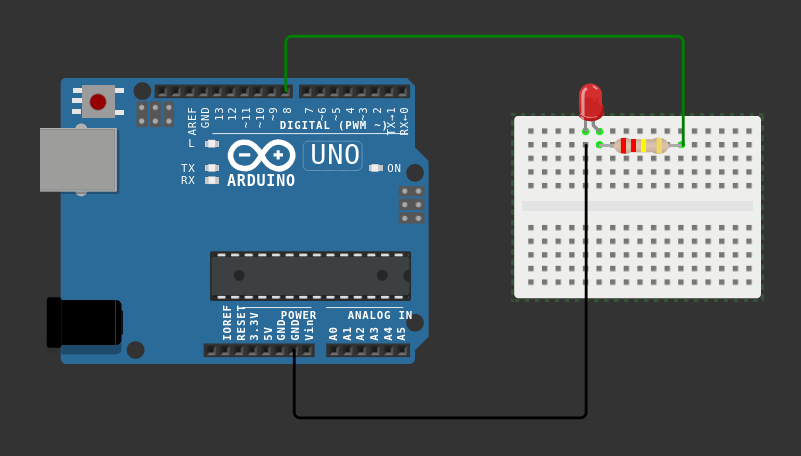

# LED Blink Project

This project demonstrates a simple LED blinking on an Arduino at 1-second intervals. It’s a basic electronics example for hobby and learning purposes.

## Components Used
- 1 × LED (any color)  
- 1 × 220Ω resistor  
- 1 × Arduino board (e.g., Arduino Uno)  
- Jumper wires  
- Breadboard  

## Circuit Setup
1. Connect the LED’s long leg (+, anode) to Arduino digital pin 8 **through a 220Ω resistor**.  
2. Connect the LED’s short leg (−, cathode) to the Arduino GND pin.  
3. Complete all connections using a breadboard or jumper wires.  

## Circuit Diagram


## Code
Use the following code in the Arduino IDE:

```cpp
int ledPin = 8;

void setup() {
  pinMode(ledPin, OUTPUT); 
}

void loop() {
  digitalWrite(ledPin, HIGH); 
  delay(1000); 
  digitalWrite(ledPin, LOW); 
  delay(1000); 
}
