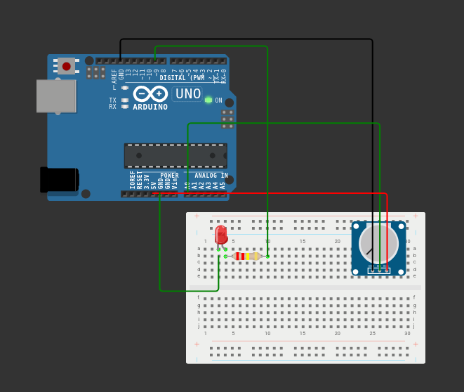

# 🎛️ Potentiometer Controlled LED – Arduino

This project demonstrates how to control the brightness of an LED using a potentiometer and PWM on Arduino.

---

## 📦 Components Required

- Arduino (Uno, Nano, etc.)
- 1 × LED
- 1 × 220Ω Resistor
- 1 × 10kΩ Potentiometer
- Breadboard
- Jumper wires

---

## 🔌 Circuit Connections

### 🎛 Potentiometer

| Pin | Connection |
|------|------------|
| Left | 5V |
| Middle | A0 |
| Right | GND |

### 💡 LED

| LED Leg | Connection |
|----------|------------|
| Long leg (+) | Pin 9 |
| Short leg (-) | 220Ω Resistor → GND |

---

## ⚙️ How It Works

- The potentiometer outputs an analog value between **0 and 1023**.
- Arduino reads this value using `analogRead()`.
- The value is converted to a **0–255 range** using `map()` for PWM control.
- `analogWrite()` adjusts the LED brightness.

---

## 🧠 Arduino Code

```cpp
const int potPin = A0;
const int ledPin = 9;

void setup() {
  pinMode(ledPin, OUTPUT);
}

void loop() {
  int potValue = analogRead(potPin);   
  int ledValue = map(potValue, 0, 1023, 0, 255);

  analogWrite(ledPin, ledValue);
}
```

---

## 📷 Circuit Preview

Add your circuit image file in the repository and reference it like this:

```markdown

```

---

## 🚀 Result

Turning the potentiometer will smoothly increase or decrease the LED brightness using PWM control.
