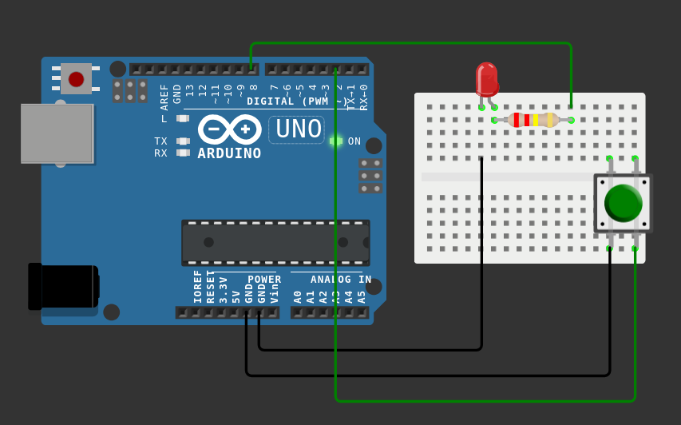

# Button Controlled LED

This project demonstrates how to control an LED using a push button with Arduino.

When the button is pressed, the LED turns on.  
When the button is released, the LED turns off.

---

## Components Used
- 1 × LED  
- 1 × 220Ω resistor  
- 1 × Push button  
- 1 × Arduino board  
- Jumper wires  
- Breadboard  

---

## Circuit Setup

### LED
- LED long leg (+) → 220Ω resistor → Digital Pin 8  
- LED short leg (−) → GND  

### Button
- One leg of the button → Digital Pin 2  
- Other leg → GND  

> The internal pull-up resistor is enabled in the code using `INPUT_PULLUP`, so no external resistor is required for the button.

---

## Circuit Diagram



---

## Code

```cpp
int ledPin = 8;
int buttonPin = 2;

void setup() {
  pinMode(ledPin, OUTPUT);
  pinMode(buttonPin, INPUT_PULLUP);
}

void loop() {
  int buttonState = digitalRead(buttonPin);

  if (buttonState == LOW) {
    digitalWrite(ledPin, HIGH);
  } else {
    digitalWrite(ledPin, LOW);
  }
}
