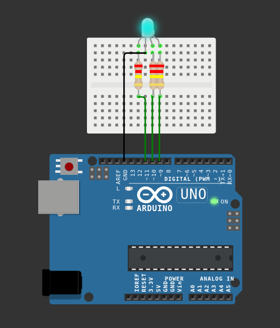

# 🌈 RGB LED Control with PWM (Common Cathode)

This project demonstrates how to control an RGB LED using PWM (0–255 values) with Arduino.

Instead of using simple HIGH/LOW values, we use `analogWrite()` to create different colors and brightness levels.

---

## 🧰 Components Used

- 1 × RGB LED (Common Cathode)
- 3 × 220Ω resistors
- 1 × Arduino board
- Breadboard
- Jumper wires

---

## 🔌 Circuit Setup (Common Cathode)

### Common Pin (Longest Leg)
→ GND

### Red Pin
→ 220Ω resistor → Pin 9

### Green Pin
→ 220Ω resistor → Pin 10

### Blue Pin
→ 220Ω resistor → Pin 11

⚠️ Each color pin must have its own resistor.

---

## 🖼 Circuit Diagram



---

## 💻 Code

```cpp
int redPin = 9;
int greenPin = 10;
int bluePin = 11;

void setup() {
  pinMode(redPin, OUTPUT);
  pinMode(greenPin, OUTPUT);
  pinMode(bluePin, OUTPUT);
}

void setColor(int red, int green, int blue) {
  analogWrite(redPin, red);
  analogWrite(greenPin, green);
  analogWrite(bluePin, blue);
}

void loop() {

  setColor(255, 0, 0);     // Red
  delay(1000);

  setColor(0, 255, 0);     // Green
  delay(1000);

  setColor(0, 0, 255);     // Blue
  delay(1000);

  setColor(255, 255, 0);   // Yellow
  delay(1000);

  setColor(255, 0, 255);   // Purple
  delay(1000);

  setColor(0, 255, 255);   // Cyan
  delay(1000);

  setColor(255, 255, 255); // White
  delay(1000);

  setColor(0, 0, 0);       // Off
  delay(1000);
}
```

---

## 🧠 How It Works

- `analogWrite()` uses PWM to control brightness.
- Values range from **0 (off)** to **255 (maximum brightness)**.
- Mixing Red, Green, and Blue creates different colors.

---

## 🚀 Future Improvements

- Smooth fade animation  
- Rainbow effect  
- RGB mixer with potentiometers  
- Button-controlled color switching  

---

Author: Your Name  
Project Type: Arduino PWM RGB Project
